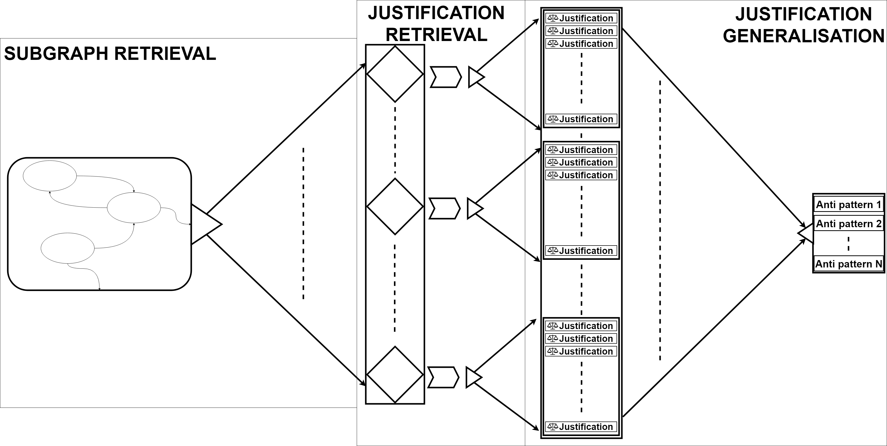

Status: Under Development (code can change)

Anti-pattern Extractor and KBgenerator
======
This github repository hosts the code for extracting anti-patterns from inconsistent knowledge graphs.

The knowledge base generator is an all encompassing piece of software designed for extracting anti-patterns from inconsistent knowledge graphs. It is the underlying software for the paper on [Analysing Large Inconsistent Knowledge Graphs](https://thomasdegroot18.github.io/kbgenerator/Writing/Analysing_Large_Inconsistent_KGs.pdf). The anti-patterns can be found here: <https://thomasdegroot18.github.io/kbgenerator/Webpages/statisticsOverview.html>

The code has been made available for reproducing the results we show in our papers. To make sure that it is possible we would refer to the [branch](https://github.com/thomasdegroot18/kbgenerator/commit/d342f82e6ce1795a141fe8ae84fa2cbef2bd20f8) . Though the code is still in active development, it is possible that the software will improve over time.

Overview of the Algorithm
-------
The algorithm consists out of three phases.
 - Subgraph retrieval, creating the set of subgraphs from the inconsistent knowledge graph.
 - justification retrieval, for each subgraph we retrieve the inconsistencies from the subgraph.
 - justification generalisation, now we convert each inconsistency to anti-pattern that we did not find previously.

</img>
A schematic diagram that shows the pipeline used to extract subgraphs, find justifications and their anti-patterns.

Features
--------

The list of key features:

 - Retrieve contradictions as justifications from an knowledge graph.
 - Convert to the justifications to anti-patterns.
 - Create a list of distinct anti-patterns per knowledge graph.
 - Calculate statistics about the knowledge graph.
 - Calculate statistics about the anti-patterns in the knowledge graph.

Requirements
-------
To install the Anti-pattern Extractor and KBgenerator, the rdfhdt library needs to be installed.
This library is used to store and read the high compression documents with the knowledge graph in it.
Mainly used to quickly read through the documents and create the subgraphs.

When using it you'll need to add the newest version of the rdfhdt.
At the moment the best method of installing is by hand.

Download the files here:
https://github.com/rdfhdt/hdt-java
Extract the package in the directory and then run on the extracted package:

 - Linux: `mvn install`
 - Windows `mvn.cmd install`

Installation
------------
To install the software for use. Open a command window in the `code` directory and run for the other necessary packages:
- Linux: `mvn install`
- Windows `mvn.cmd install`

Useage
---------
To use, create a location where you store the HDTs. e.g. In the `code/resources` create a folder `HDTs` where you'll be storing the HDTs for anti-pattern extraction.

Finally run the code executing `run.sh`

Contribute
----------

- Issue Tracker: https://github.com/thomasdegroot18/kbgenerator/issues
- Source Code: https://github.com/thomasdegroot18/kbgenerator

Support
-------

If you are having issues, please let us know via github.

License
-------

The project is licensed under the MIT license.

Credits
-------
 - Developer: Thomas de Groot
 - OWLAPI: https://owlcs.github.io/owlapi
 - RDFHDT: https://github.com/rdfhdt/hdt-java
 - Openllet: https://github.com/Galigator/openllet
 - Jena: https://jena.apache.org

<!-- Joe Raad, Stefan Schlobach, and Thomas de Groot -->
